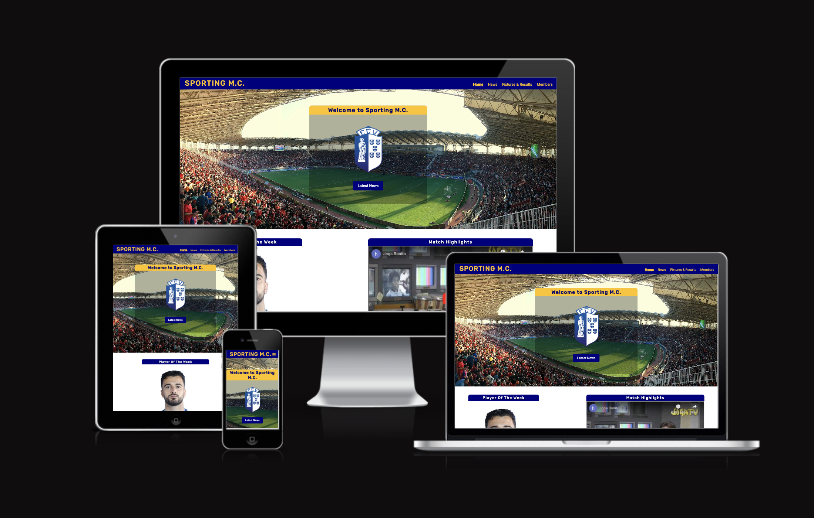

# Sporting M.C.

Live site: https://markclinton.github.io/sporting-mc/index.html

## Index – Table of Contents
* [About](#about) 
* [Design](#design)
* [Target Audience](#target-audience)
* [Features](#features)
* [Testing](#testing)
* [Languages Used](#technologies-used)
* [Deployment](#deployment)
* [Credits](#credits)
* [Issues](#issues)

## About
Sporting M.C. is a website for a fictional football club. The name "Sporting M.C." is a mix of the term "Sporting" which refers to a sporting club and is widely used in naming teams in the Portuguese League. As football grows in the USA some clubs are adopting the moniker "Sporting". M.C. are my initials. Putting them both together gave birth to the idea "Sporting M.C.". Sporting M.C. uses the crest and logo of the portuguese football team FC Vizela. 

The aim of the website is so supporters of Sporting M.C. can keep up to date with club news, view upcoming fixtures and results of previous matches and allows you to sign up and become a member of the club. The fictional club Sporting M.C. take part in the Primeira Liga, Portugal's top flight division. 

## Design
The website is intended to be colorful in its design and full of content related to the team. 

- ### Colour Scheme 
The two main colors of the site (#000080, #ffc300) provide a complementary color harmony as they directly oppose each other on the RGB color wheel. I also just happen to like both yellow and blue when used together.  

- ### Imagery
The hero image was chosen as a reflection of all the fans who support the club by showing a packed stadium. The background images were chosen to keep the theme of the site. Football centric imagery. Because the team is based in Portugal and competes in the Primeira Liga, real teams such as Sporting CP, FC Porto appear on the Fixtures & Results page for a sense of realism. 

- ### Typography 
Google font was used to pick 2 complimentary fonts. Roboto and Rubik are the fonts used. Rubik used for H elements. Roboto used for P elements.

- ### Wireframes
The site was initially designed using Balsamiq. [Link to the Wireframes PDF](documentation/wireframes/Portfolio%201%20Wireframes.pdf)

## Target Audience
The intended audience for this site are football fans. More specifically fans of Sporting M.C. Visitors to the site will want to know what's happening with the club, latest news, latest results, upcoming fixtures. The intent is to have everything available to fans that they need to keep up to date with the club. 

## Features

- ### Nav Bar

  - Fully responsive navigation bar design featured on all pages throughout the site. Allows users to easily navigate throughout the site regardless of screen size.

    

Navbar

    

    

- ### Home Page

  - The Hero section features the crest of the club and a call to action button which allows them to navigate through the site faster to see the content they want.
  - The landing page contains the main hero image which clearly shows the intent of the site. It also includes some easily digestible media in the form of short, snappy articles and an embedded youtube video. 

    

Home

    

    

- ### News

  - The News page is fully responsive allowing the user to comfortably read articles regardless of the device they are using. 

    

News

    

    

- ### Fixtures & Results

  - The fixtures and results page shows a detailed table in 2 sections. 1 for Upcoming Fixtures and 1 for Results. The table includes all the information needed to keep up to date with the club as well as images for each club.

    

Fixtures & Results

    

    

- ### Membership Form

  - Interactive Membership form to allow users to sign up and become a member. 
  - Only accepts valid emails.
  - Includes fields for First Name, Last Name, Email and a choice of Individual or Family Membership.

    

Members

    

    

- ### Response

  - On form submission it displays a page with a custom message thanking the user for becoming a member. 

    

Response

    

    

## Technologies

### Languages
- HTML5
- CSS3

### Other Tools
- [GitHub](https://github.com/)
- [Git](https://git-scm.com/)
- [Google Fonts](https://fonts.google.com/)
- [GoFullPage](https://gofullpage.com/) to take full page screenshots.
- [Responsive Viewer](https://chrome.google.com/webstore/detail/responsive-viewer/inmopeiepgfljkpkidclfgbgbmfcennb/related?hl=en) for testing my site on all screen sizes.
- [Balsamiq](https://balsamiq.com/?gad_source=1&gclid=CjwKCAjw9IayBhBJEiwAVuc3fqVfzQ-WmLrsaC-4HITwUoROC3SzPwvg7clfnKMbm35oxgybc0CbrhoCsC0QAvD_BwE) for creating wireframes of my project.
- [fontawesome](https://fontawesome.com/icons) for providing free icons. 
- [CSS3 Button Generator](https://css3buttongenerator.com/) for help on designing the look and feel for my form button. 

## Deployment

- ### Github Pages
  - In the repository, navigate to Settings > Pages.
  - From the Source dropdown choose "Deploy from a branch".
  - Choose "main" as the branch.
  - When the master branch is selected it will initiate a build and deployment of the site.
  - Any changes pushed to the main branch will automatically be built and deployed once set up.
  - Link to live GitHub Page can be found [here](https://markclinton.github.io/sporting-mc/index.html)

- ### Clone Repo
  - Navigate to the [Sporting M.C.](https://github.com/MarkClinton/sporting-mc) repository.
  - Click "Code" and choose the HTTPS tab.
  - Copy the URL. 
  - Open a terminal window and paste `git clone https://github.com/MarkClinton/sporting-mc.git` to the directory you want.

## Testing

- ### Screen Size Testing
To test the responsiveness of my website across all screen sizes I mainly used the Developer Tools to mainly test this. I also used Responsive Viewer to get an overview of my site on several screens at once to help spot any mistakes. 

- ### Validator Testing
  - HTML: using the [W3 Validator](https://validator.w3.org/) no errors were found for all pages.
    
    - [index.html](documentation/w3_validator_images/index_valid.png) 
    - [news.html](documentation/w3_validator_images/news_valid.png) 
    - [members.html](documentation/w3_validator_images/members_valid.png) 
    - [fixtures_results.html](documentation/w3_validator_images/fixtures_results_valid.png) 
    - [response.html](documentation/w3_validator_images/response_valid.png) 

    

  - CSS: Using the [Jigsaw Validator](https://jigsaw.w3.org/css-validator/) no errors were found. 
    1 warning was highlighted for font imports. 
    Imported style sheets are not checked in direct input and file upload modes
    - [style.css](documentation/w3_validator_images/style_valid.png) 

    

- ### Manual Testing 

|  Feature |  Action | Effect | Pass/Fail |
|---|---|---|---|
|Logo|Click|Brings back to Home page| Pass |
|Call to action button|Click|Navigates to the News page| Pass |
|Navbar Links|Click on Home|Opens the Home page| Pass |
||Click on News|Opens the News page| Pass |
||Click on Fixtures & Results|Opens the Fixtures & Results page| Pass |
||Click on Members|Opens the Members page| Pass |
|Members Page|Fill out the form and submit|The form is submitted and a Thank you message appears| Pass |
||Attempt to submit empty|Error pops up in field that's left empty| Pass |
|Response Page|Click Homepage button|Navigates back to the home page| Pass |
|Social Media Links|Test Youtube link|Youtube opens in a separate tab| Pass |
||Test Twitter(X) Link|Twitter(X) opens in a separate tab| Pass |
|Footer Link|Test Footer link|Footer link directs back the Home page| Pass |
|2024 Season Membership Link|Test 2024 Season Membership link|Link directs to the Members page| Pass |

- ### Compatibility Testing
  - Chrome Desktop Version 125.0.6422.41
  - Safari Desktop Version 17.4.1 (19618.1.15.11.14)

## Credits

- ### Resources
 
  - [Favicon Generator. For real.](https://realfavicongenerator.net/) to generate free favicons.
  - [Google Fonts](https://fonts.google.com/) for a range of free fonts. 
  - [Stack Overflow](https://stackoverflow.com/) for help answering questions
  - [W3 Schools](https://www.w3schools.com/) for documentation and interactive help with html and css.
  - [HTML Color Codes](https://htmlcolorcodes.com/color-picker/) for choosing different shades and colors.
  - [EZGif](https://ezgif.com/maker) for creating gifs for the ReadMe
  - [Cloud Convert](https://cloudconvert.com/) for converting images to .webp format.
  - [Kevin Powell Youtube](https://www.youtube.com/@KevinPowell): Kevin's videos on [Flex-Box](https://www.youtube.com/watch?v=hwbqquXww-U&list=PL4-IK0AVhVjMSb9c06AjRlTpvxL3otpUd) and [CSS Positions](https://www.youtube.com/watch?v=fF_NVrd1s14) were a helpful resource to better understand the topics.
  - [Love Running](https://github.com/MarkClinton/Love-Running-Walkthrough) the Love Running project was a great resource which I used for the Navbar, Footer and Form components on my site. 

- ### Media

  - [Unsplash](https://unsplash.com/) for free to use images.
  - [Football Web Pages](https://www.footballwebpages.co.uk/portuguese-primeira-liga/teams) for images of team crests in the Portuguese League.
  - [FC Vizela](https://fcvizela.pt/) for player headshots. 
  - [Logowik](https://logowik.com/fc-vizela-vector-logo-8490.html) for the main image of crest.
  - [FC Porto](https://www.fcporto.pt/en/news) for inspiration on football news articles.
  - [Premier League](https://www.premierleague.com/matchweek/12305/blog) for inspiration on design, layout and content. 

- ### Helpful Links

  - [Stack Overflow Post on Flexbox](https://stackoverflow.com/questions/39644585/using-flex-order-property-to-re-arrange-items-for-desktop-and-mobile-views): This Stack Overflow article helped me with fixing my flexbox issue for my middle article positioning. The intent was to have the article viewable like the one above it when on mobile but when the screen was for desktop that the image be on the left and the article header and content be contained on the right. [Link to code](https://github.com/MarkClinton/sporting-mc/blob/e5fe8238415a538ee9f5f4d5991509932f0bfa3a/news.html#L84).
  - [Stack Overflow Post on Text outline](https://stackoverflow.com/questions/11323813/how-to-outline-text-in-html-css): Because one of my nav items was larger than the others I couldn't assign it an accurate width without messing up the rest of the nav spacing. This would cause a slight movement if I used font-bold on hover. Instead, I used text shadow to achieve some sort of bold text. 
  - [Stack Overflow Post on styling Radio Buttons](https://stackoverflow.com/questions/37069238/how-to-change-the-font-style-in-radio-button): I wanted a custom style for my radio buttons to fit the theme of the site. Using this Stack Overflow post I was able to do it. 

- ### Acknowledgments 
  - Big thanks to my mentor Juliia for the help and support throughout this project. She shared some great knowledge and resources which were very valuable for understanding how different components work. 

## Bugs
- The GitHub repository contained a file called .DS_Store during the development. This file should
not have been committed to the repository. I manually deleted the file from the repo directly as it was
not appearing locally. I then added it to my .gitignore file to stop future pushes of this file.
- I wanted to implement Navbar links to be bold on hover. If I set the items to be bold on hover it would slightly move the items in the navbar. Due to the width of the "Fixtures & Results" nav item I couldn't find a width to satisfy all navbar items. This would lead to wasted space making the other navbar items look odd. In the end I used a text shadow to give the illusion of bold text when hovered. 
- Pre-planning my site. I created the initial wireframes for this website but should have included more detail. More detail in the actual div elements I planned to create. Without having these divs created in a wireframe it lead to wasted time back and forth debating on which styles looks good.
- ReadMe. While the ReadMe wasn't an issue I only kept a running log in a separate file on my desktop instead of creating the ReadMe as I went. I should have started with the ReadMe format and filled it in as each page was created. 
- Due to the fact the website is for a fictional football team I couldn't get any highlights for the team to include on the home page. Instead, I added a video of the 2006 Nike advert "Joga Bonito".